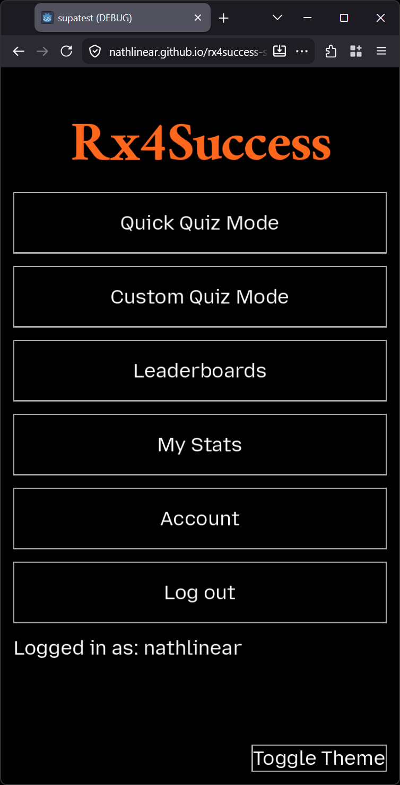
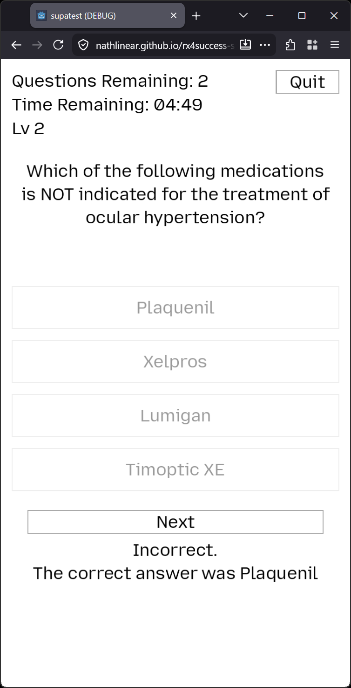
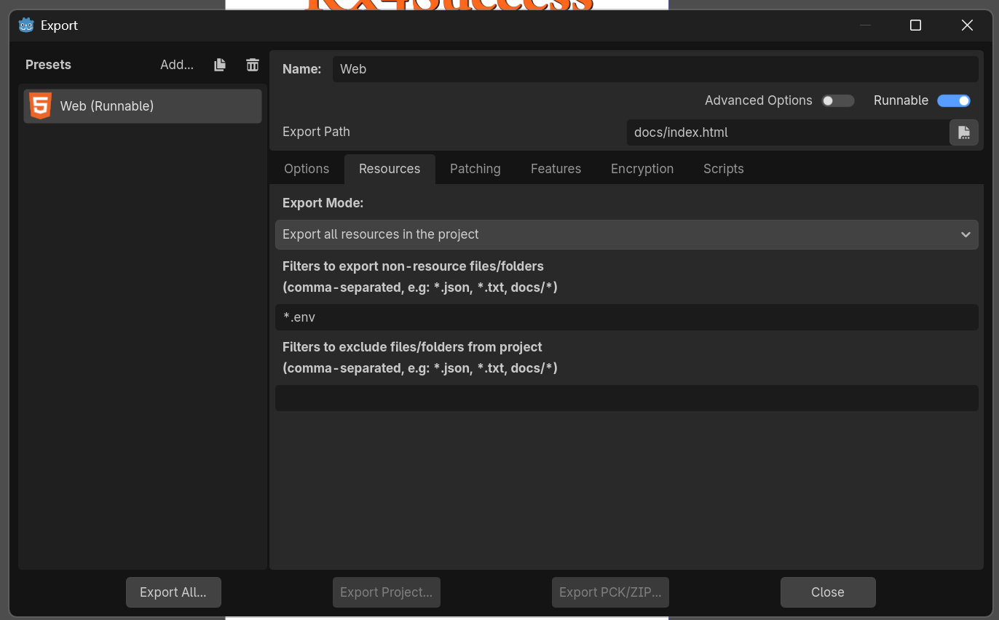

# Rx4Success

A web application made for the University of the Pacific Pharmacy School in collaboration with the School of Engineering and Computer Science to help pharmacy students study drug properties.

## Usage

The web application can be found at https://nathlinear.github.io/rx4success-study-client/ 

The web application is designed around a portrait display. Usage with a landscape/desktop display might cause issues with the user interface.

Below is a QR code of the above link for easy phone access.


Example screenshots of the application can be seen below.




The rest of the information below is intended for developers. Pharmacy students do not need to read or know the below information in order to use the applicaiton.

## Building

The web application was made with Godot 4, specifically version `v4.6.2.stable.official [71f334935]`. The download link for this specific version of Godot can be found at https://godotengine.org/download/archive/4.6.2-stable/

Once downloaded and unzipped, open the executable `Godot_v4.6.2-stable_win64.exe`, not the console version. Import this project into Godot and open it.

In the top left, go to Project then Export. Have Godot download and install the export preset for Web builds if needed, then build the project into the `docs` folder. Allow Godot to replace the existing `index.html` file. The file `index.pck` will also be changed for new builds.

To host this new build on the website, add both `index.html` and `index.pck` to a commit and push to Github. Github will then host the application as the repo's "Page".

Further information on how to begin using Godot can be found at https://docs.godotengine.org/en/4.6/getting_started/introduction/first_look_at_the_editor.html

Further information on how to build the project can be found at https://docs.godotengine.org/en/4.6/tutorials/export/exporting_projects.html#export-menu

## Troubleshooting / Q&A

*Login / supabase connection works in Godot game preview but not in web build.*

Make sure that `*.env` files are included within the web export, as seen below.



Build settings are defined in `export_presets.cfg` file, so this shouldn't become an issue unless the file is changed, a future Godot version changes its behavior, or Supabase / the godot supabase plugin changes (https://github.com/supabase-community/godot-engine.supabase).

*I need access to the Supabase backend.*

Plesse reach out to `nathlinear@gmail.com` for access to the backend database or for more details on the backend implementation.

*How were the themes made?*

A Godot plugin was used to generate the light and dark themes, with the potential to generate more themes. The plugin details and its usage can be found at https://github.com/Inspiaaa/ThemeGen

*How are the questions generated?*

Various Python scripts were made to convert Microsoft Excel files to a SQLite3 database, which was then used to generate the questions by using a template and criteria for what choices could be offered.

These excel files have not been included within the repo as a security measure. These files should be given to you by the pharmacy faculty member leading the development of this project.

The first excel file, called `brandGenericUse.xlsx`, should have the following exact column names:

```
KEY
base
generic
dosageForm
dosage
form2
brand
use
pclass
```

The second excel file, called `distractors.xlsx`, should have the following exact column names:

```
KEY
brand
generic
use
```

The first Python script, `processExcel.py`, takes these two excel files and converts it into a SQLite3 database.

The second Python script, `quiz2.py` , creates questions based on templates provided by the pharmacy faculty member then writes them to the file `questions.md`.

## Further development goals

Client priority = Feature priority and implementation depends on the client.

| Feature | Priority | Expected Difficulty |
| - | - | - |
| Make the Python question generator be its own application and usable by non-developers (pharmacy faculty). | High | Very Hard |
| Add descriptions for difference between Quick Quiz and Custom Quiz modes | Medium | Easy |
| Account settings saving (save to supabase for account synced settings or save to browser) | Medium | Normal |
| Add toggle to question history to filter between correct / incorrect | Medium | Normal |
| Allow session saving to browser to remove need to login every time | Medium | Hard |
| Make a new settings page or combine with existing page (like account) | Low | Easy |
| Add setting to color correct choice green and selected choice red (if incorrect) | Low | Easy |
| Add color schemes beyond dark/light mode (gray, green, orange) | Low | Normal |
| Allow choosing accent color other than blue | Low | Hard |
| Perform further testing on the usability of the usesr interface if changed | Medium | Hard |
| Add a learning mode / more in depth than regular quiz mode | Client | Hard |
| Add explanation for why a chosen choice is wrong | Client | Hard |
| Difficulty level progression | Client | Hard |
| Add advisor to know what they need to do for the next level | Client | Hard |
| Allow students to move quickly through levels if they already know the information | Client | Hard |
| Automatically detect levels based on database | Client | Medium |